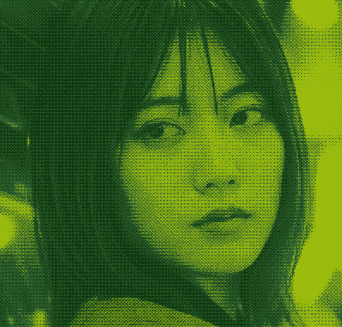

# Image Dithering Studio

A modern, high-performance web application for applying dithering effects to images. Transform your photos with classic retro aesthetics using various dithering algorithms and color palettes inspired by Marathon and other iconic games.



## Features

### 🎨 Multiple Dithering Algorithms

- **Floyd-Steinberg** - Classic error diffusion algorithm with excellent quality
- **Atkinson** - Apple's signature dithering method with distinctive aesthetics
- **Jarvis-Judice-Ninke** - Wide error diffusion for smooth gradients
- **Stucki** - High-quality error diffusion with balanced distribution
- **Burkes** - Fast error diffusion with good results
- **Sierra** - Three-row error diffusion for detailed output
- **Two-Row Sierra** - Faster variant of Sierra algorithm
- **Sierra Lite** - Lightweight version for quick processing
- **Bayer 8x8** - Ordered dithering with characteristic crosshatch patterns
- **Random** - Randomized dithering for organic textures

### 🎭 Rich Color Palettes

- **Grayscale** - Classic black and white
- **Classic** - Traditional 8-color palette
- **Warm Colors** - Earth tones and warm hues
- **Cold Colors** - Cool blues and cyans
- **Sepia** - Vintage photo aesthetic
- **Neon** - Vibrant cyberpunk colors
- **Pastel** - Soft, muted tones
- **Earth Tones** - Natural browns and greens
- **Ocean** - Deep sea colors
- **Forest** - Woodland greens
- **Sunset** - Orange and pink gradients
- **Cyberpunk** - High-tech neon palette
- **Vaporwave** - Retro 80s aesthetic
- **Marathon** - Inspired by the classic game
- **Marathon 2** - Enhanced Marathon palette
- **Marathon Infinity** - Expanded color range
- **Custom** - Create your own palette

### ⚙️ Image Adjustments

- **Brightness** - Lighten or darken your image
- **Contrast** - Adjust the difference between light and dark areas
- **Saturation** - Control color intensity before dithering

### 🚀 Performance

- Web Worker implementation for non-blocking image processing
- Real-time preview updates
- Efficient memory management
- Responsive interface

## Getting Started

### Prerequisites

- Node.js 18+
- npm or pnpm

### Installation

1. Clone the repository:
```bash
git clone https://github.com/DernierExile/InkNoise.git
cd InkNoise
```

2. Install dependencies:
```bash
npm install
```

3. Create a `.env` file (optional, only needed if using Supabase features):
```bash
cp .env.example .env
```

4. Start the development server:
```bash
npm run dev
```

5. Open your browser to `http://localhost:5173`

## Usage

1. **Upload an Image** - Click the upload area or drag and drop an image
2. **Choose a Dithering Algorithm** - Select from 10 different algorithms
3. **Select a Color Palette** - Pick from 17 preset palettes or create custom
4. **Adjust Settings** - Fine-tune brightness, contrast, and saturation
5. **Download** - Save your dithered masterpiece

## Building for Production

```bash
npm run build
```

The optimized files will be in the `dist` directory.

## Technology Stack

- **React 18** - Modern UI framework
- **TypeScript** - Type-safe development
- **Vite** - Lightning-fast build tool
- **Tailwind CSS** - Utility-first styling
- **Lucide React** - Beautiful icon set
- **Web Workers** - Background processing

## Project Structure

```
src/
├── components/          # React components
│   ├── ControlPanel.tsx    # Settings and controls
│   ├── ImagePreview.tsx    # Image display
│   └── ImageUpload.tsx     # File upload
├── utils/              # Core utilities
│   ├── adjustments.ts      # Image adjustments
│   ├── dithering.ts        # Dithering algorithms
│   ├── imageResize.ts      # Image processing
│   └── palettes.ts         # Color palettes
├── workers/            # Web Workers
│   └── dithering.worker.ts # Background processing
└── types/              # TypeScript definitions
```

## Contributing

Contributions are welcome! Please feel free to submit a Pull Request.

1. Fork the project
2. Create your feature branch (`git checkout -b feature/AmazingFeature`)
3. Commit your changes (`git commit -m 'Add some AmazingFeature'`)
4. Push to the branch (`git push origin feature/AmazingFeature`)
5. Open a Pull Request

## License

This project is licensed under the MIT License - see the [LICENSE](LICENSE) file for details.

## Acknowledgments

- Dithering algorithms based on classic image processing techniques
- Marathon color palettes inspired by Bungie's Marathon series
- Built with modern web technologies for optimal performance

## Support

If you encounter any issues or have questions, please file an issue on the GitHub repository.

---

Made with ❤️ for retro computing enthusiasts
