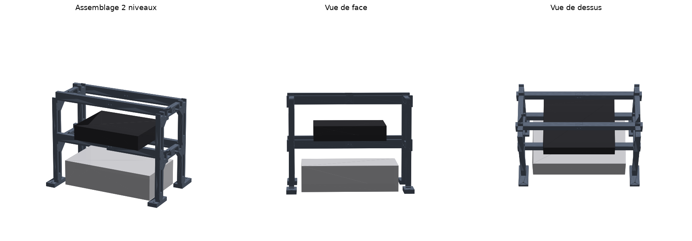
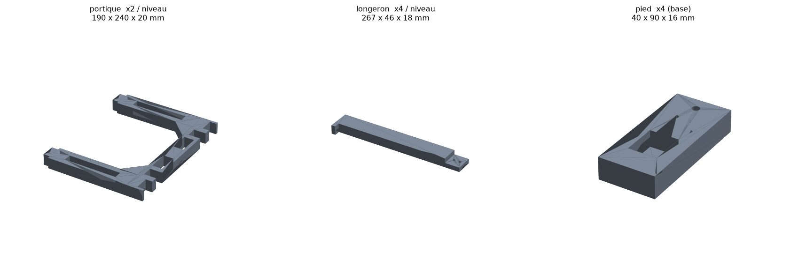
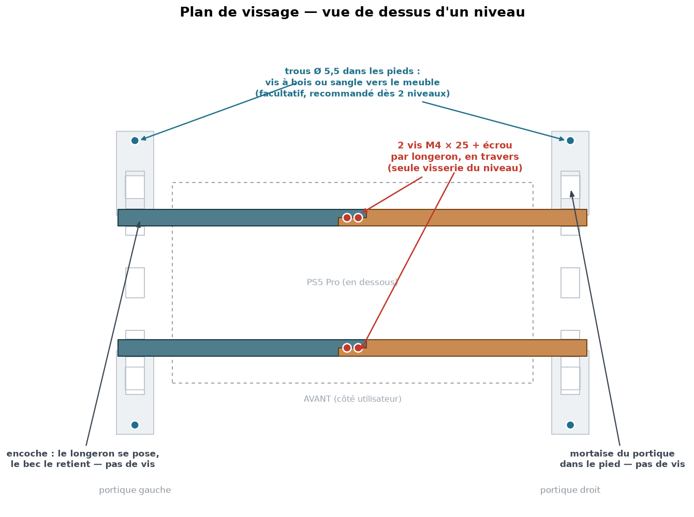
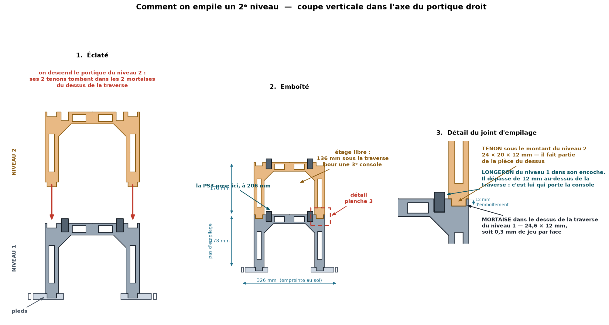
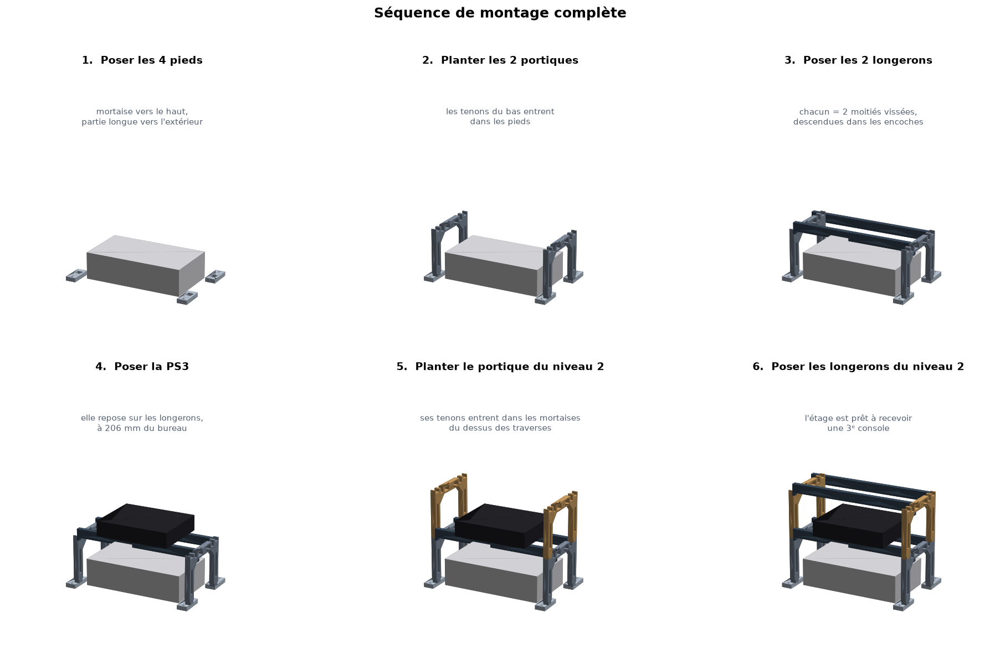
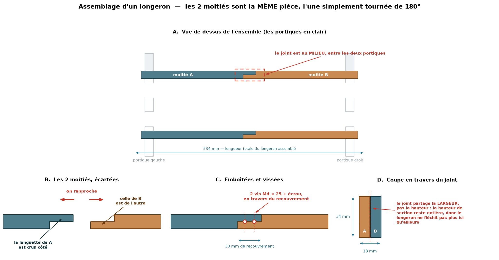

# Support modulaire empilable pour consoles — PS5 Pro + PS3

Une étagère qui **enjambe** la PS5 Pro sans jamais la toucher et porte la PS3
au-dessus. **Empilable** : un deuxième module se pose sur le premier pour
ajouter un étage, autant de fois que nécessaire.

Conçu pour une **Bambu Lab P1P** (plateau 256 × 256 mm). Aucune pièce ne
nécessite de support d'impression.



## Principe

Deux **portiques** en U inversé se dressent aux extrémités gauche et droite de
la PS5. Ils sont orientés dans la *profondeur* de la console (216 mm) et non
dans sa largeur (388 mm) : c'est ce qui permet à chaque portique de s'imprimer
**d'une seule pièce**. Aucun joint ne se trouve dans le chemin de charge
vertical — le poids descend en compression pure jusqu'au bureau.

Deux **longerons** relient les portiques et portent la console du dessus. Ils
sont trop longs pour le plateau, donc coupés en deux ; le recouvrement partage
la *largeur* et non la hauteur, si bien que la section garde son moment
quadratique intact au droit du joint.

## Pièces à imprimer

| Fichier | Quantité | Dimensions | Pose sur le plateau |
|---|---|---|---|
| `portique.stl` | **2 par niveau** | 190 × 240 × 20 mm | à plat |
| `longeron.stl` | **4 par niveau** | 267 × 46 × 18 mm | **en diagonale** (enveloppe 221 mm) |
| `pied.stl` | **4 au total** (base uniquement) | 40 × 90 × 16 mm | à plat |

Les 4 longerons sont la même pièce : deux d'entre eux sont simplement tournés
de 180° au montage, leurs recouvrements s'emboîtent.

Les pieds ne sont à imprimer qu'une fois — les modules supérieurs se plantent
directement dans les mortaises du module du dessous.



## Matière et réglages

**PETG obligatoire**, pas de PLA. La pièce vit au-dessus d'une console qui
rejette de l'air chaud, et le PLA ramollit vers 55-60 °C. L'ASA convient aussi.

| Réglage | Valeur |
|---|---|
| Couche | 0,20 mm (buse 0,4) ou 0,28 mm (buse 0,6) |
| Parois | 4 |
| Remplissage | 20 %, gyroïde |
| Supports | **aucun** — toutes les pièces sont prismatiques |
| Adhérence | bâton de colle obligatoire : le PETG soude au PEI texturé sur de grandes empreintes |

**Filament et temps** : environ **520 g et 30-35 h par niveau** en buse 0,4
(≈ 20-24 h en buse 0,6), plus **110 g** pour le jeu de 4 pieds. C'est un gros
chantier — prévois une bobine par niveau.

## Quincaillerie

- **4 × vis M4 × 25 + écrous + rondelles par niveau** — elles serrent les deux
  recouvrements de longeron à mi-portée (2 vis par longeron).
- Facultatif mais recommandé : une sangle ou 4 vis à bois passant par les trous
  Ø 5,5 des pieds, pour ancrer l'ensemble au meuble (voir Sécurité).
- Quelques patins feutre ou silicone autocollants sous les pieds et sur le
  dessus des longerons (antidérapant sous la console).

## Montage

Les planches `montage-1` à `montage-4` détaillent tout visuellement. Les coupes
sont extraites directement des maillages : ce qui est dessiné est exactement ce
qui sortira de l'imprimante.

### Ce qui se visse — et ce qui ne se visse pas



| Jonction | Fixation | Visserie |
|---|---|---|
| pied ↔ portique | tenon dans mortaise, gravité | **aucune** |
| portique ↔ longeron | encoche + bec de retenue | **aucune** |
| moitié A ↔ moitié B d'un longeron | recouvrement de 30 mm | **2 × M4 × 25 + écrou + 2 rondelles** |
| niveau N ↔ niveau N+1 | tenon dans mortaise, gravité | **aucune** |
| pieds ↔ meuble | trou Ø 5,5 en bout de pied | facultatif : vis à bois Ø 4 × 30 ou sangle |

Soit **4 vis M4 par niveau**, toutes au milieu des longerons. Rien d'autre.

### Étape 0 — assembler les longerons (sur l'établi, avant tout le reste)

1. Prends 2 demi-longerons, pose-les à plat, **bec vers le bas**.
2. Fais pivoter l'un des deux de 180° **à plat** (comme une aiguille de montre,
   sans le retourner). Les becs sont alors aux deux extrémités opposées, tous
   les deux vers le bas.
3. Rapproche-les : les languettes glissent l'une contre l'autre et se
   recouvrent sur 30 mm, côte à côte, à la même hauteur. Si elles se cognent au
   lieu de glisser, tu as *retourné* une moitié au lieu de la *tourner* :
   vérifie que les deux becs pointent bien vers le bas.
4. Les 2 perçages Ø 4,4 de chaque languette tombent en face l'un de l'autre. Ils
   sont à 6 mm de part et d'autre du milieu du joint, à mi-hauteur (17 mm du
   dessous).
5. Vis M4 × 25 + rondelle, enfilée **en travers** (horizontalement,
   perpendiculaire au longeron), rondelle + écrou de l'autre côté. Serrage à la
   main plus un quart de tour de clé, pas davantage : le PETG se marque.
6. Idem pour le second longeron. Tu as deux poutres de 534 mm, rigides, avec un
   bec à chaque bout.

### Étape 1 — les pieds

Pose les 4 pieds sur le bureau autour de la PS5, **poche rectangulaire vers le
haut**. Le trou rond Ø 5,5 est à l'extrémité longue : cette extrémité va vers
l'*extérieur* (vers l'avant pour les 2 pieds avant, vers l'arrière pour les 2
arrière). Entraxes des poches : 206 mm entre les 2 pieds d'un même côté, 468 mm
de gauche à droite. Pas besoin d'être précis, les longerons recalent tout à
l'étape 3.

### Étape 2 — les portiques

Le portique est symétrique : pas de sens avant/arrière ni de face
intérieure/extérieure. Les 2 tenons sous ses montants (petits blocs de
24 × 20 × 12 mm) entrent dans les 2 poches des 2 pieds d'un même côté. Pousse à
fond, le montant doit toucher le pied. Même chose de l'autre côté. Le portique
tient debout seul mais peut encore glisser avec ses pieds — c'est voulu.

### Étape 3 — les longerons

Regarde le dessus des traverses : chacune porte, de l'intérieur vers
l'extérieur, **2 encoches de 18,6 mm** (à 70 mm du milieu) puis **2 mortaises de
24,6 mm** (à 103 mm, juste au-dessus des montants). Les encoches sont pour les
longerons, les mortaises pour le niveau suivant — n'y mets rien maintenant.

Descends un longeron assemblé, bec vers le bas, dans l'encoche *avant* des deux
portiques. Les becs viennent se plaquer contre la **face extérieure** de chaque
portique. Si un bec bute sur le dessus d'un portique, écarte légèrement ce
portique en faisant glisser son pied. Une fois les deux becs descendus, le
longeron dépasse de 12 mm au-dessus des traverses et ne peut plus bouger : les
encoches le bloquent en avant/arrière, les becs en gauche/droite. Même chose
pour le second longeron dans l'encoche *arrière*.

À ce stade l'ensemble ne bouge plus quand on le pousse. Pour le déplacer,
soulève-le par les portiques, jamais par les longerons (ils sortiraient de
leurs encoches).

### Étape 4 — la console

Pose la PS3 sur les deux longerons, centrée. Elle repose sur les 12 mm qui
dépassent. Des patins feutre autocollants sur le dessus des longerons évitent
qu'elle glisse.

### Étape 5 — ajouter un niveau



Un nouveau portique : ses 2 tenons entrent dans les **2 mortaises extérieures**
du dessus de la traverse du niveau en place (celles de 24,6 mm, pas les
encoches de 18,6 qui sont occupées). Descends-le à fond. Aucune vis. Puis deux
longerons préparés comme à l'étape 0, posés comme à l'étape 3. Le pas est de
178 mm et chaque étage offre 136 mm de hauteur libre sous la traverse suivante.

Le jeu d'emboîtement est de 0,3 mm par face. Si les tenons forcent, un coup de
lime suffit ; s'ils sont trop libres, baisse `FIT` dans le script et réimprime.

### Étape 6 — ancrage

Chaque pied a un trou Ø 5,5 à son extrémité extérieure. Deux vis à bois
Ø 4 × 30 dans les deux pieds arrière suffisent, ou une sangle passée dans les
trous. À faire dès qu'il y a un second niveau.





## Cotes de l'ouvrage

| | |
|---|---|
| Empreinte au sol | 508 × 326 mm |
| Pas d'empilage | 178 mm par niveau |
| Plan de pose de la console, niveau 1 | 206 mm |
| Hauteur libre pour la console de chaque étage | 136 mm |
| Air libre au-dessus de la PS5 | 49 mm |
| Jeu latéral de part et d'autre de la PS5 | 30 mm |

La PS5 reste **entièrement dégagée à l'arrière** (là où se trouve sa grande
grille d'échappement) et sur toute sa face avant : rien ne passe devant les
ports, le bouton d'alimentation ni la fente du lecteur. Elle s'extrait en la
faisant glisser vers l'avant, sans rien démonter.

## Sécurité — à lire

**Vérifie tes cotes avant d'imprimer.** Le modèle part de : PS5 Pro à plat
388 × 216 mm d'empreinte et 105 mm de haut avec le lecteur, plus ~5 mm de pieds.
Mesure la tienne au mètre ; si l'écart dépasse quelques millimètres, change les
constantes en tête de `generate_support.py` et relance.

**Basculement.** Une pile de deux niveaux chargée bascule à environ 27° d'angle,
ce qui est le domaine du mobilier stable — mais une console qui tombe atterrit
sur la PS5 Pro. Dès le deuxième niveau, **ancre l'ensemble** : une sangle par
les trous des pieds arrière, ou deux vis dans le meuble. Ça coûte deux minutes.

**Ventilation.** Ne pose jamais l'ensemble dans un meuble fermé et garde 10 cm
entre l'arrière de la PS5 et le mur, comme le demande Sony. Les flancs et
l'arrière de la structure sont volontairement ouverts : l'air chaud monte et
s'échappe librement sur les côtés, il n'est pas renvoyé vers la console du
dessus.

## Adapter le modèle

Toutes les cotes sont des constantes nommées en tête de `generate_support.py`.
Les plus utiles :

| Constante | Rôle |
|---|---|
| `PS5_W`, `PS5_D`, `PS5_H` | encombrement de la console du bas |
| `GAP_SIDE`, `GAP_TOP` | dégagements imposés autour d'elle |
| `LEG_H` | hauteur des montants — c'est elle qui fixe le pas d'empilage |
| `RAIL_Y` | écartement des longerons, à adapter à la profondeur de la console posée |
| `FIT` | jeu d'emboîtement (0,30 mm par face) si les tenons sont trop durs ou trop libres |

```bash
pip install numpy trimesh manifold3d
python3 generate_support.py
```

Le script vérifie automatiquement que chaque pièce est étanche et tient sur le
plateau, et `build_assembly()` permet de remonter l'ouvrage virtuellement pour
contrôler qu'aucune pièce n'en touche une autre.
